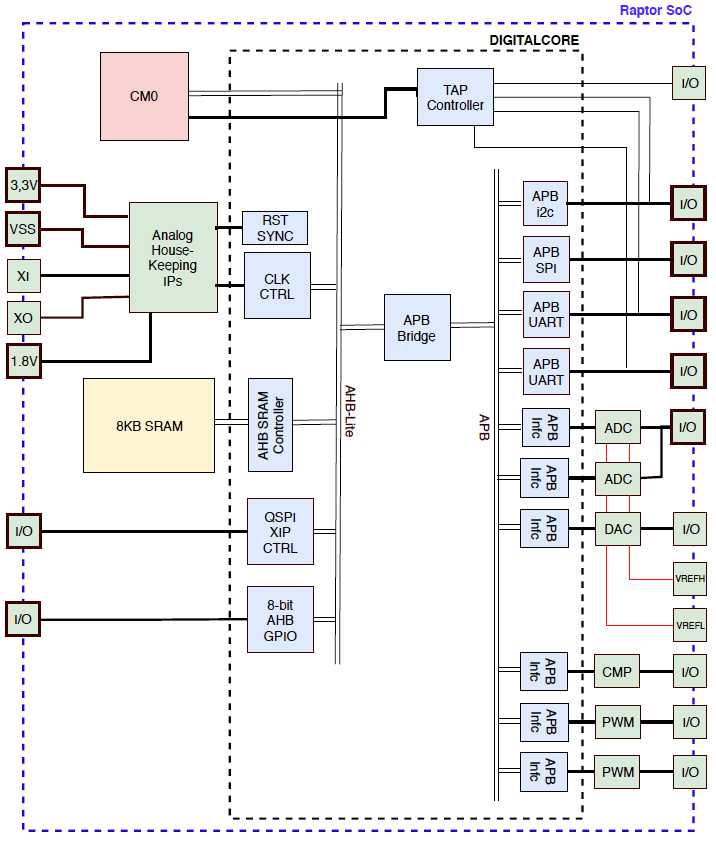

#Overview

Raptor is a full SoC reference design for IoT applications based on the Arm Cortex M0 CPU core targeted on the X-FAB 
XH018 process (180nm).  Raptor provides means to interface with analog and digital sensors as well as external RF radio 
(WIFI, Cellular, Bluetooth, etc.,) modules needed for IoT applications.

The reference design is based on an SoC design template and can be modified, compiled and simulated through the SoC 
Editor tool with CloudV on the Efabless platform. The reference design comes with basic device drivers for all on-chip 
peripherals as well as set of applications to test and demonstrate Raptor capabilities.

Instances of the Raptor Design Template can be configured through the Design Request Form.   A configuration file is 
generated upon saving the form and can be used as a starting point for generating a reference design or to request a 
turn-key delivery of a custom SoC through design partners on the Efabless platform.

Below is the block diagram for a Demo Chip configuration taped-out for Raptor.  The design files for project include an 
instance of Raptor based on the configuration shown below.

##Project Contents
This project contains the design files for Raptor EVB, an evaluation board with a fully implemented SoC based on the 
Raptor template.  The pcba design files are based on Kicad.

The project also contains firmware example code using the Raptor EVB board.

#Hardware

#Firmware

The firmware examples can be built from their respective directories through the makefile.  The building the image files
requires install the gcc arm compiler.  Download install packages for the compiler can be found on the [Arm Developer 
Web Site](https://developer.arm.com/tools-and-software/open-source-software/developer-tools/gnu-toolchain/gnu-rm/downloads).

###To program the SPI flash chip:

  1. Install the pyftdi python library
  
    pip3 install pyftdi
  
  2. Configure the board for flash programming.

    Install jumpers on across pins 2 & 3 on the four 3-pin headers 
    next to the USB connector.
    
    Ensure the jumper for usb to Raptor uart are not installed 
    (two 2-pin headers next to USB)

  3. Change to the directory for the target firmware

    make clean hex flash

  4. Configure the board for processor operation

    Move jumpers on across pins 1 & 2 on the four 3-pin headers 
    next to the USB connector.